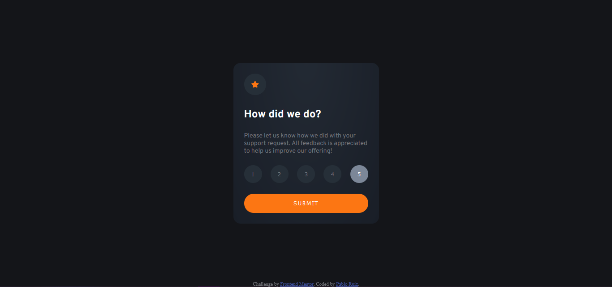
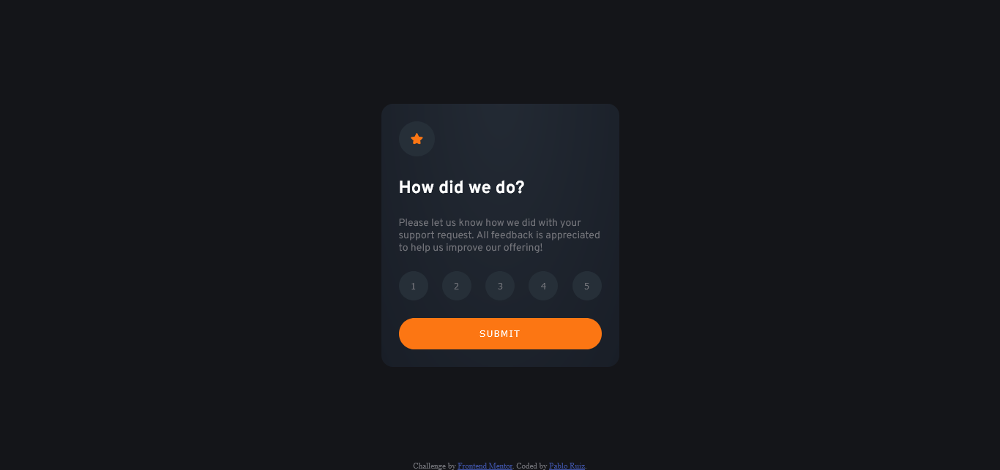
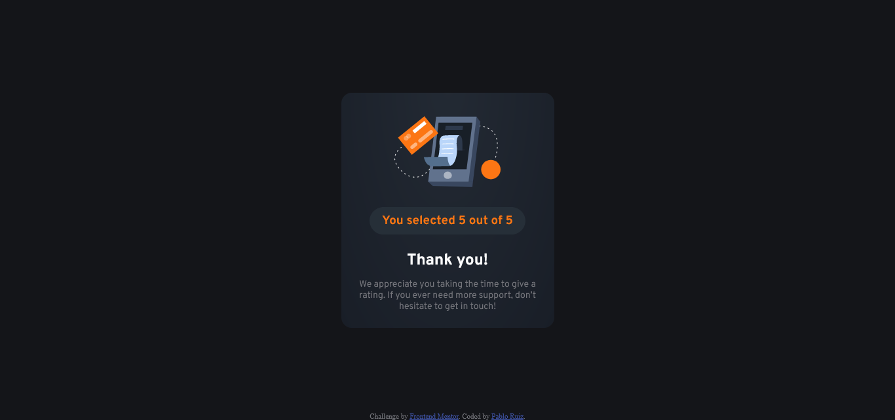
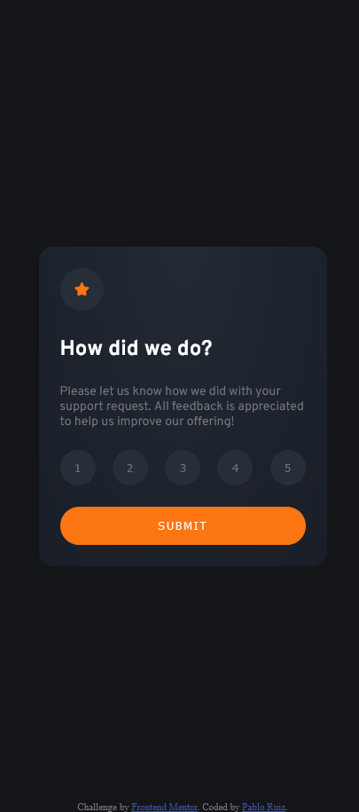

# Frontend Mentor - Interactive rating component

This is a solution to the [Interactive rating component challenge on Frontend Mentor](https://www.frontendmentor.io/challenges/interactive-rating-component-koxpeBUmI).

## Table of contents

- [Overview](#overview)
  - [Screenshot](#screenshot)
  - [Links](#links)
- [Built with](#built-with)
- [Author](#author)
- [Acknowledgments](#acknowledgments)

## Overview

Project to practice HTML, CSS and JavaScript.

### Screenshot

### Links

- Solution repository: (https://github.com/PabloRuiz92/interactive-rating-component-main.github.io)
- Live Site URL: (https://pabloruiz92.github.io/interactive-rating-component-main.github.io/)

### Built with

- Semantic HTML5 markup
- CSS custom properties
- Flexbox
- JavaScript

## Author

- Frontend Mentor - [@PabloRuiz92](https://www.frontendmentor.io/profile/PabloRuiz92)
- LinkedIn - https://www.linkedin.com/in/pablo-agustin-ruiz/

## Acknowledgments

I know that the way I managed the events it´s not the best, but I'm learning the basics for now. 
I might come back to polish this one later.